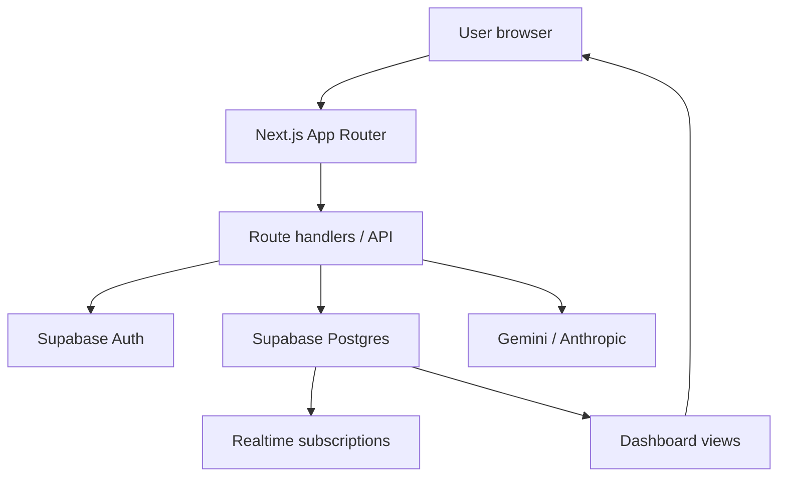

# ArenaOS

    

  

**One control layer for game day.** ArenaOS is a real-time stadium operating system that unifies crowd intelligence, navigation, incident response, transport, accessibility, sustainability, and role-based operations into a single live experience.

ArenaOS is built with Next.js, TypeScript, Tailwind CSS, and Supabase. It is designed to help venue teams coordinate faster while giving fans and staff a clearer picture of what is happening in the venue right now.

---

## Table of contents

- [Project overview](#project-overview)
- [Problem statement](#problem-statement)
- [Solution](#solution)
- [Features](#features)
- [AI assistant](#ai-assistant)
- [User roles](#user-roles)
- [Technology stack](#technology-stack)
- [Architecture](#architecture)
- [Folder structure](#folder-structure)
- [Database](#database)
- [Authentication flow](#authentication-flow)
- [Realtime](#realtime)
- [API documentation](#api-documentation)
- [Environment variables](#environment-variables)
- [Installation](#installation)
- [Deployment](#deployment)
- [Demo accounts](#demo-accounts)
- [Performance](#performance)
- [Security](#security)
- [Accessibility](#accessibility)
- [Testing](#testing)
- [Roadmap](#roadmap)
- [Contributing](#contributing)
- [License](#license)
- [Acknowledgements](#acknowledgements)

---

## Project overview

ArenaOS is a multi-role venue operations platform for live events. The product is built as a working full-stack application, not a static mockup. Every major dashboard reads from the same Supabase-backed data model and updates in near real time.

### What ArenaOS is

ArenaOS combines a modern web frontend, server-side authentication, a relational data layer, and role-aware dashboards into one operational experience. It is intended for stadium operations teams who need to manage crowd movement, incidents, transport flow, accessibility needs, sustainability metrics, and communications from one place.

### What problem it solves

Modern venue operations are fragmented. Gates, parking, emergency response, navigation, and attendee guidance often exist in separate tools or offline processes. That fragmentation makes it difficult to respond quickly when conditions change.

### Why it exists

ArenaOS exists to make the venue response loop faster. When a gate becomes congested, a medical incident is reported, or a shuttle is delayed, the information can be surfaced to the right people immediately.

### Real-world use case

A match-day organizer can watch attendance, crowd density, incident status, and parking conditions in one place. A fan can see the least-crowded gate, choose an accessible route, and ask the assistant for direction. A volunteer or medical responder can follow a guided workflow and update incident status for the team.

### Why AI is used

AI is used in ArenaOS as a role-aware assistant that can answer venue questions with live data context from gates, routes, matches, weather, and tickets. It is meant to make operational guidance and attendee support faster and more contextual.

---

## Problem statement

Stadium operations usually involve several interconnected pain points:

- Crowd management: queues build up unexpectedly, and organizers need to redirect traffic before it becomes a bottleneck.
- Parking and transport: lots fill up and shuttles become delayed, which creates friction for attendees arriving and leaving.
- Navigation: fans need to know where to go quickly, especially under time pressure.
- Emergency response: incidents require fast triage, coordination, and clear workflows.
- Communication: staff, volunteers, and attendees need the right information at the right moment.
- Volunteer coordination: assignments and incident response are easier when tasks are visible and structured.
- Accessibility: attendees with different mobility or assistive needs require route options and settings that support them.

ArenaOS addresses these needs through a shared live data model and role-aware interfaces that surface the right information for each user.

---

## Solution

ArenaOS solves these problems by creating one shared operations layer for the venue.

- Crowd: live gate status, crowd trend charts, and congestion indicators help staff react early.
- Parking and transport: parking lots, shuttle timing, and exit recommendations are surfaced in dedicated modules.
- Navigation: route options include fastest, least-crowded, and accessible paths.
- Emergency: incident workflows are guided and can be reported or resolved directly from the interface.
- Communication: profile, notifications, and activity feeds help users stay aware of what changed.
- Volunteer coordination: assignments can be created, assigned, and updated from the shared data model.
- Accessibility: users can personalize voice guidance and live captions, and the app highlights accessible routes.

The platform is intentionally built around one central source of truth: the Supabase database.

---

## Features

### Landing experience

- Marketing landing page with hero content, module highlights, role-focused sections, and calls to action.
- Responsive layout built in Next.js and Tailwind CSS.
- Brand-oriented visual language for a venue operations experience.

### Authentication and identity

- Sign up, login, password reset, and password change flows.
- Email confirmation handling during sign-up.
- Remember-me support using a custom storage adapter.
- Role selection during onboarding.
- Server-side session refresh and protected route handling.

### Supabase Auth integration

- Auth sessions are managed with Supabase SSR.
- Session cookies are refreshed in the middleware layer.
- Auth callbacks are handled through the dedicated callback route.
- Account deletion uses the service role client on the server.

### Realtime features

- Realtime subscriptions power live dashboards and view updates.
- Gate status, incidents, crowd trend points, venue stats, and other modules update without a full refresh.
- The simulation engine writes to Supabase and updates connected dashboards instantly.

### Crowd intelligence

- Live gate monitoring with crowd percentage, wait time, and status.
- Crowd trend history and venue-wide density visualization.
- Congestion advisory and redirect suggestions.

### Navigation

- Route cards for fastest, least-crowded, and accessible paths.
- Destination search and route preview experience.
- Route data is linked to the live database.

### Emergency

- Incident reporting for lost child, medical, fire, and security workflows.
- AI-guided step-by-step response flow.
- Incident status tracking and resolution workflow.

### Transport

- Parking lot utilization tracking.
- Shuttle departure and ETA visibility.
- Exit route recommendations based on current conditions.

### Sustainability

- Water, energy, and waste diversion metrics.
- Sustainability tracker with progress feedback.

### Accessibility

- Accessible route discovery.
- Voice guidance and live captions toggles in user preferences.
- Accessibility page for assistive tools and route guidance.

### Notifications

- Per-user notifications.
- Read and mark-all-read actions.
- Notification feed backed by the Supabase tables.

### Organizer dashboard

- Organizer control center with venue stats, incident overview, parking and transport indicators, crowd trend visuals, and simulation controls.
- AI-driven recommendations based on current live data.

### Admin dashboard

- Admin overview with user listing, incidents, tickets, parking, assignments, and activity history.
- Admin preview mode allows an admin to view dashboards as another role without switching accounts.

### Fan dashboard

- Fan-facing summary of recommended gates, average wait, busiest gate, and live venue conditions.
- Match and weather overview.
- Quick actions for navigation, transport, assistant, and help.

### Volunteer dashboard

- Volunteer tasks and emergency workflow support.
- Task assignments and incident response integration.

### Staff dashboard

- Staffing and operations-oriented views for crowd, transport, sustainability, and emergency tasks.

### AI assistant

- Role-aware assistant experience.
- Live context from gates, routes, matches, weather, tickets, and profile role.
- Gemini-first integration with Anthropic fallback when configured.
- Graceful not-configured state when no AI keys are set.

### Simulation engine

- Organizer/admin-only simulation toggle.
- Periodic updates to gates, parking, shuttles, weather, and crowd trend points.
- Realtime propagation through the shared Supabase data model.

### Profile and settings

- Profile page with avatar, role badge, activity, and ticket summary.
- Account settings for profile editing, avatar upload, password change, email change, theme, notifications, language, profile visibility, and account deletion.

### Dark mode

- Theme support with persisted user preference.
- Theme is applied without a visible flash on initial paint.

### Storage and uploads

- Avatar upload support through Supabase Storage.
- Storage bucket policies are defined in the repository SQL assets.

### Email templates

- Supabase email template assets are included for sign-up confirmation, reset password, email change, magic link, and welcome emails.

### Role-based access

- Profiles include a role field.
- Navigation and module access are role-aware.
- Row Level Security policies constrain what each role can read or modify.

---

## AI assistant

The AI assistant lives in [app/api/assistant/route.ts](app/api/assistant/route.ts) and is one of the product’s core differentiators.

### Gemini integration

Gemini is the preferred AI provider in the current implementation. The assistant route sends a request to the Gemini API when a key is configured. If Gemini is unavailable, the assistant falls back to Anthropic when that key is configured.

### Role-aware behavior

The system prompt is built server-side using the signed-in user’s role. The assistant can respond differently for fans, organizers, volunteers, security, medical, staff, and admins.

### Prompt construction

The prompt includes:

- User full name and role
- Current or active ticket
- Current match context
- Latest weather snapshot
- Live gate status
- Live route data

This grounding makes the assistant more operational and less generic.

### Live database context

The assistant is not a scripted chatbot. It fetches live values from Supabase before composing a response. That means the answer is based on the venue’s current state.

### Weather, match, routes, tickets, and gates

The system prompt uses the latest available data from the database to speak about:

- Gate wait and crowd status
- Available routes and crowd levels
- Match status and score
- Weather conditions
- The user’s active ticket

### Organizer and fan AI use cases

- Fans can ask for the best route, nearest restroom, or gate guidance.
- Organizers can ask for operational recommendations based on gates, parking, incidents, and crowd patterns.
- Volunteers and responders can get concise guidance for live incidents.

### How it works internally

1. The UI sends a message to the assistant API route.
2. The route authenticates the user and loads live venue and profile context from Supabase.
3. The server builds a prompt with role-specific instructions and live context.
4. The request is sent to Gemini or Anthropic.
5. The model response is returned to the UI and rendered in the chat experience.

---

## User roles

| Role | Purpose | Permissions | Dashboard | Capabilities |
|---|---|---|---|---|
| Admin | Full platform oversight | Full visibility across tables and role preview | Admin overview | Read across the system, preview other roles, manage broad operations |
| Organizer | Run the event from a control center | Access to venue stats, incidents, parking, transport, crowd, assignments, simulation | Organizer control center | Monitor operations, start simulation, review recommendations |
| Fan | Attend the event and get guidance | Read live venue info and route data | Fan dashboard | Find gates, check transport, ask the assistant, navigate comfortably |
| Volunteer | Support event operations on the ground | Read assignments and incident data | Emergency/operations views | Report incidents, act on assigned tasks |
| Staff | Handle venue logistics | Read crowd, transport, sustainability, and incident data | Staff-facing operations dashboards | Support facilities and operations processes |
| Security | Respond to safety concerns | Read crowd and incident data | Emergency and crowd views | Coordinate response and monitor threats |
| Medical | Handle medical incident response | Read incident and emergency information | Emergency response | Follow medical workflow and update incident state |

The role is stored in the profiles table and is used by the frontend navigation and backend RLS rules.

---

## Technology stack

### Frontend

- Next.js 16 App Router
- React 19
- TypeScript
- Tailwind CSS
- Lucide icons
- Recharts for charts
- clsx for class composition

### Backend

- Next.js route handlers
- Server-side Supabase clients
- Role-aware server logic
- Custom proxy-based session refresh layer

### Database

- Supabase Postgres
- SQL schema and RLS files in the repository
- Realtime subscriptions over public tables

### Authentication

- Supabase Auth
- SSR auth helpers
- Cookie-based session management
- Email confirmation and password reset flows

### Storage

- Supabase Storage for avatar uploads
- Public bucket support for avatars

### Realtime

- Supabase Realtime channels
- Postgres changes subscriptions
- Live dashboard updates without manual refreshes

### AI

- Gemini API (preferred)
- Anthropic API fallback

### Deployment

- Vercel-ready Next.js application
- Environment-variable-based configuration

### Utilities

- ESLint
- TypeScript compiler
- Custom dashboard data-loading hooks

---

## Architecture



The flow is intentionally simple:

1. Users interact with the Next.js application.
2. The app accesses Supabase for auth, data, and realtime.
3. API routes can also call Gemini or Anthropic for assistant responses.
4. Realtime updates propagate through the shared schema to all active clients.

---

## Folder structure

```text
app/
  api/
    assistant/
    simulate/
    account/delete/
  auth/
  dashboard/
  login/
  signup/
  forgot-password/
  reset-password/
  role-select/
  about/
  help/
  layout.tsx
  page.tsx

components/
  assistant/
  dashboard/
  landing/
  layout/
  ui/

contexts/
  AdminPreviewContext.tsx
  AuthContext.tsx
  ThemeContext.tsx

hooks/
  useAuth.ts
  useSupabaseData.ts

lib/
  navigation.ts
  supabase/
    auth.ts
    client.ts
    env.ts
    middleware.ts
    queries.ts
    server.ts
    types.ts

public/

services/
  AIService.ts
  AssignmentService.ts
  CrowdService.ts
  IncidentService.ts
  MatchService.ts
  NotificationService.ts
  ParkingService.ts
  ProfileService.ts
  SimulationService.ts
  TicketService.ts
  WeatherService.ts

supabase/
  email-templates/
  fix-schema-cache.sql
  rls.sql
  schema.sql
  seed.sql
  storage.sql

types/
  index.ts
```

### What each folder contains

- app/: App Router pages, dashboard pages, auth pages, and API routes.
- components/: UI components for landing pages, dashboards, assistant chat, layout, and shared UI primitives.
- contexts/: Shared React context providers for auth, theme, and admin previewing.
- hooks/: Reusable data-loading and auth hooks.
- lib/: Shared utilities and Supabase integration helpers.
- services/: Thin domain-specific wrappers for data access and operations.
- supabase/: Database schema, RLS, storage, seed data, and email template assets.
- public/: Static assets.
- types/: Shared TypeScript types used across the app.

---

## Database

ArenaOS uses a Supabase Postgres schema with explicit tables for profiles, venue data, operations, and user preferences.

### Core tables

| Table | Purpose |
|---|---|
| profiles | Stores the user profile, role, and avatar reference |
| gates | Stores gate crowd percentage, wait minutes, and status |
| incidents | Stores operational incidents and their state |
| routes | Stores navigation route options |
| sustainability_metrics | Stores sustainability reporting metrics |
| venue_stats | Stores summary venue KPIs |
| crowd_trend_points | Stores time-series crowd trend samples |
| notifications | Stores per-user notifications |
| user_preferences | Stores theme, language, accessibility, and notification settings |
| activity_log | Stores activity history for auditing and profile views |
| parking_lots | Stores parking lot occupancy state |
| shuttles | Stores shuttle ETA and crowd context |
| tickets | Stores ticket-related rows for the current user |
| matches | Stores match status and score context |
| weather_snapshots | Stores weather snapshots |
| assignments | Stores volunteer/staff task assignments |

### Relationships

- profiles.id is referenced by incidents.reported_by, notifications.user_id, user_preferences.user_id, activity_log.user_id, tickets.user_id, assignments.assignee_id.
- incidents are operational records and are visible to responders, organizers, and administrators.
- gates, parking_lots, shuttles, weather_snapshots, and crowd_trend_points power the live dashboards.
- matches and weather are used by the assistant and dashboards for contextual information.
- tickets are currently used to surface a user’s active or booked tickets in profile and assistant contexts.

### Notes about the schema

The schema includes Row Level Security policies and triggers for profile creation. The seed SQL file populates demo data for gates, routes, incidents, parking, shuttles, crowd trend, weather, and matches.

---

## Authentication flow

### Signup

- The signup page collects full name, email, and password.
- Supabase Auth creates an auth account and the trigger provisions a corresponding profile row.
- The app can require email confirmation depending on Supabase project settings.

### Login

- The login page authenticates using email and password.
- A custom storage adapter stores the session in localStorage or sessionStorage depending on the remember-me choice.
- The app redirects to the role selection flow after successful login.

### Remember me

- The remember-me checkbox toggles whether the session is stored in localStorage or sessionStorage.
- This behavior is implemented in the browser-side Supabase client adapter.

### Email verification

- Supabase email confirmation is supported via the auth callback route.
- Users who need confirmation see a pending inbox state instead of being logged in immediately.

### Password reset

- Reset password requests are supported through the auth flow.
- The reset flow redirects back to the reset-password page via the auth callback route.

### Delete account

- Account deletion uses a server-side route and the service-role client.
- The operation is designed to cascade through the associated tables.

### Session refresh

- The middleware/proxy layer refreshes the Supabase session on each request.
- Protected routes under /dashboard redirect unauthenticated users to /login.

---

## Realtime

Realtime is central to ArenaOS.

### How it works

- The app uses Supabase Realtime channels from the browser client.
- The reusable hooks in [hooks/useSupabaseData.ts](hooks/useSupabaseData.ts) subscribe to table changes and refetch data when inserts, updates, or deletes occur.

### What updates live

- Gates
- Incidents
- Venue stats
- Crowd trend points
- Parking lots
- Shuttles
- Tickets
- Activity logs
- Other data-backed views

### Simulation engine

The simulation engine writes to the same tables that power the dashboards. Because the changes are written to Supabase, all connected clients receive them through realtime subscriptions.

---

## API documentation

### POST /api/assistant

Purpose: Send a chat message to the ArenaOS assistant.

Request body:

```json
{
  "message": "Where is the nearest exit?",
  "history": [],
  "context": { "gate": "Gate 4" }
}
```

Response:

```json
{
  "reply": "The assistant response",
  "source": "gemini"
}
```

Authentication: Requires an authenticated user when interacting with live context. The route can also return a graceful “not configured” message if no AI key exists.

### POST /api/simulate

Purpose: Run one simulation tick for organizers or admins.

Request: No body required.

Response:

```json
{
  "ok": true,
  "changes": ["6 gate(s) updated", "crowd trend point added"]
}
```

Authentication: Requires an authenticated user with organizer or admin role.

### POST /api/account/delete

Purpose: Delete the signed-in account using the service-role client.

Request: No body required.

Response:

```json
{
  "ok": true
}
```

Authentication: Requires an authenticated user. The route uses the server-only service-role key.

### GET /auth/callback

Purpose: Exchange an auth code for a Supabase session after email confirmations or password reset flows.

Query parameters:

- code: Supabase auth code
- next: redirect destination

Response: Redirects to the appropriate dashboard or login page.

---

## Environment variables

Create a .env.local file in the project root and set the variables below.

| Variable | Required | Description |
|---|---|---|
| NEXT_PUBLIC_SUPABASE_URL | Yes for live data | Your Supabase project URL |
| NEXT_PUBLIC_SUPABASE_PUBLISHABLE_KEY | Yes for live data | Supabase publishable anon key |
| NEXT_PUBLIC_SUPABASE_ANON_KEY | Optional fallback | Legacy anon key alias |
| SUPABASE_SERVICE_ROLE_KEY | Yes for account deletion | Server-only secret key |
| GEMINI_API_KEY | Optional | Enables Gemini-powered assistant replies |
| GEMINI_MODEL | Optional | Gemini model name, defaults to gemini-flash-latest |
| ANTHROPIC_API_KEY | Optional | Enables Anthropic fallback for assistant replies |
| ANTHROPIC_MODEL | Optional | Anthropic model name, defaults to claude-sonnet-5 |

If the Supabase environment is missing, the application degrades gracefully and shows a “database not connected” state instead of crashing.

---

## Installation

### 1. Clone the repository

```bash
git clone https://github.com/ankitpal32/ArenaOS.git
cd ArenaOS
```

### 2. Install dependencies

```bash
npm install
```

### 3. Create environment variables

Create a .env.local file and add the values from the environment variables section above.

### 4. Run the development server

```bash
npm run dev
```

Open http://localhost:3000.

### 5. Set up Supabase

1. Create a Supabase project.
2. Run the SQL files in this order:
   - supabase/schema.sql
   - supabase/rls.sql
   - supabase/storage.sql
   - supabase/seed.sql
3. Copy the project URL and keys into your .env.local file.

### 6. Optional AI setup

Add Gemini or Anthropic credentials to enable the assistant.

### 7. Optional email templates

If you want branded auth emails, copy the HTML templates from supabase/email-templates into the relevant Supabase Auth email settings.

---

## Deployment

### Vercel deployment

ArenaOS is designed to be deployed on Vercel.

Recommended deployment steps:

1. Push the repository to GitHub.
2. Create a Vercel project.
3. Import the repository.
4. Set the environment variables from the previous section.
5. Deploy the project.

### Production checklist

- Supabase project is live and SQL has been applied.
- Supabase URL and keys are configured in Vercel env vars.
- Gemini or Anthropic keys are configured if the AI assistant should work in production.
- The app is served from a production domain with HTTPS.

### Preview deployments

Preview deployments work the same way as production, with separate environment variables if needed.

---

## Demo accounts

There are no built-in demo credentials shipped in the repository. The app expects real accounts created through Supabase Auth.

| Role | Email | Password |
|---|---|---|
| Fan | Created at sign-up | Chosen at sign-up |
| Organizer | Created at sign-up | Chosen at sign-up |
| Volunteer | Created at sign-up | Chosen at sign-up |
| Staff | Created at sign-up | Chosen at sign-up |
| Security | Created at sign-up | Chosen at sign-up |
| Medical | Created at sign-up | Chosen at sign-up |
| Admin | Created at sign-up | Chosen at sign-up |

To promote a user to admin, set their profiles.role value to admin in Supabase.

---

## Performance

ArenaOS is optimized around a few practical patterns:

- Server-rendered Next.js pages and layouts where appropriate.
- Realtime subscriptions are scoped to relevant tables and UI state.
- The app uses a lightweight domain-service layer so data access remains predictable.
- The UI degrades gracefully when Supabase is not configured.
- The project avoids unnecessary client-side state where server-side context is sufficient.

The current implementation prioritizes correctness, clarity, and live data behavior over heavy optimization work. The architecture is designed to support additional performance tuning later.

---

## Security

Security is implemented at multiple layers:

- Supabase Auth for account and session handling.
- Row Level Security for table access restrictions.
- Protected route handling for dashboard access.
- Server-only service-role usage for privileged operations.
- Server-side account deletion route to avoid exposing privileged actions to the browser.

The repository explicitly avoids exposing the service-role key to the client.

---

## Accessibility

The UI includes several accessibility-oriented practices:

- Keyboard-friendly form and navigation interactions.
- ARIA-friendly alert and status states in auth pages.
- Contrast-friendly styling across the dashboard experience.
- Responsive layout for desktop and mobile use.
- Support for assistive preferences through voice guidance and live captions options.

The project is not a comprehensive accessibility audit, but accessibility has been treated as a first-class part of the UI.

---

## Testing

There are currently no dedicated automated tests in the repository.

### Current status

- No Vitest configuration
- No React Testing Library setup
- No Playwright configuration

### Recommended next steps

If you want to harden the project, the next logical testing stack would be:

- Vitest for unit tests
- React Testing Library for component behavior
- Playwright for end-to-end flows such as signup, dashboard access, and assistant behavior

---

## Roadmap

The current implementation is a strong foundation for future expansion. Possible next steps include:

- Payments and checkout flows
- QR ticket generation and validation
- IoT sensor integration
- Face recognition or biometric workflows
- Predictive AI for crowd forecasting
- Offline-first support
- Push notifications
- Multi-venue support

These are future directions and are not implemented in the current repository.

---

## Contributing

Contributions are welcome.

### Suggested workflow

1. Fork the repository.
2. Create a feature branch.
3. Make your changes.
4. Verify the app still builds and the code remains consistent with the existing architecture.
5. Open a pull request with a clear description of the change.

### Contribution guidelines

- Keep changes aligned with the existing domain-driven service structure.
- Preserve the real-data and realtime-first behavior of the product.
- Avoid introducing mock data into business logic where the app already uses Supabase-backed state.
- Document new tables, services, or API routes clearly.
- Be explicit about any new environment variables.

---

## License

ArenaOS is distributed under the MIT License.

---

## Acknowledgements

ArenaOS builds upon and integrates several open-source and cloud technologies:

- Next.js
- React
- TypeScript
- Tailwind CSS
- Supabase
- Google Gemini
- Vercel
- Lucide icons
- Recharts

---

If you want, the next step can be to add a dedicated LICENSE file and a proper .env.example file to match this README exactly.
